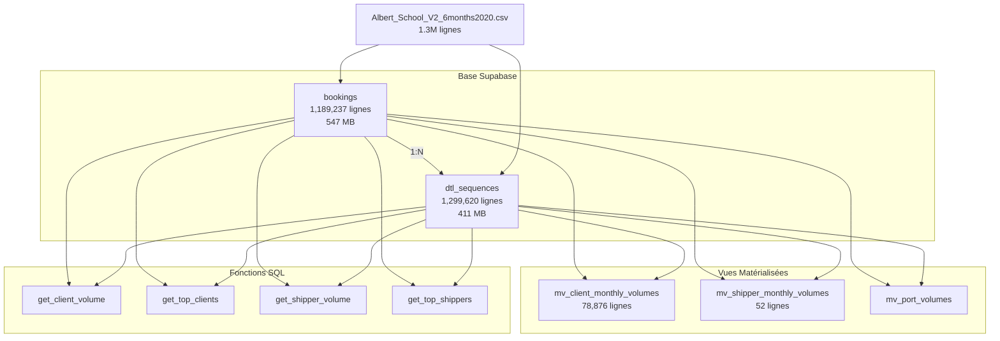
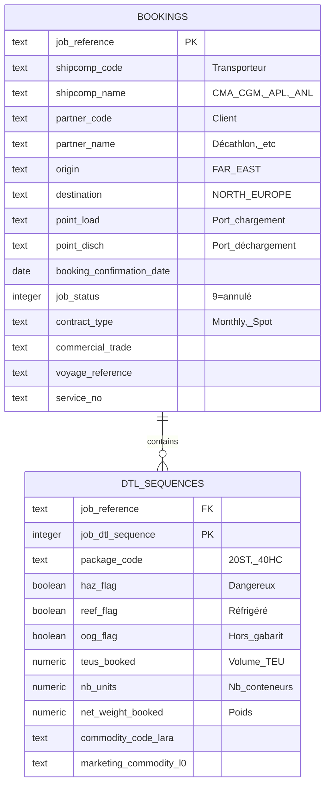
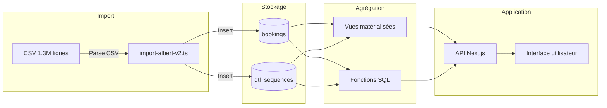
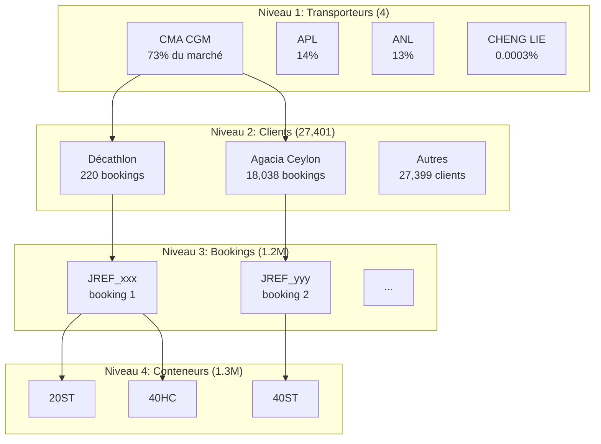
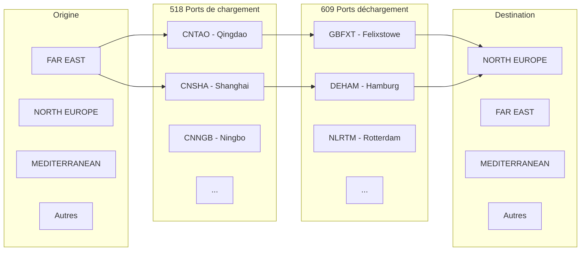
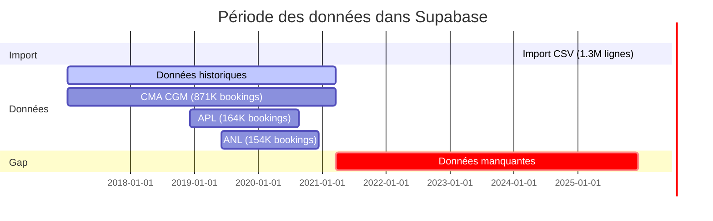
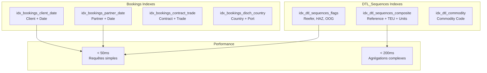
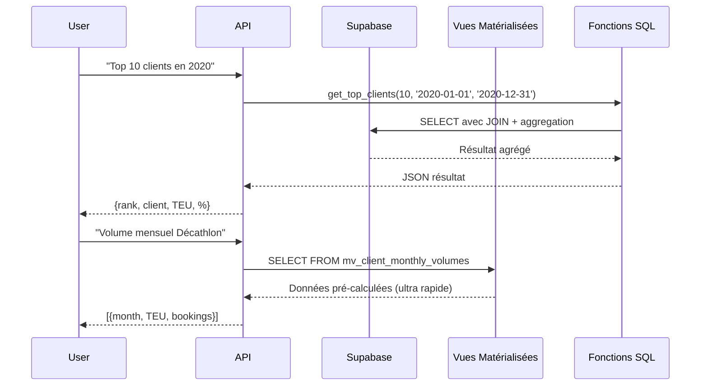
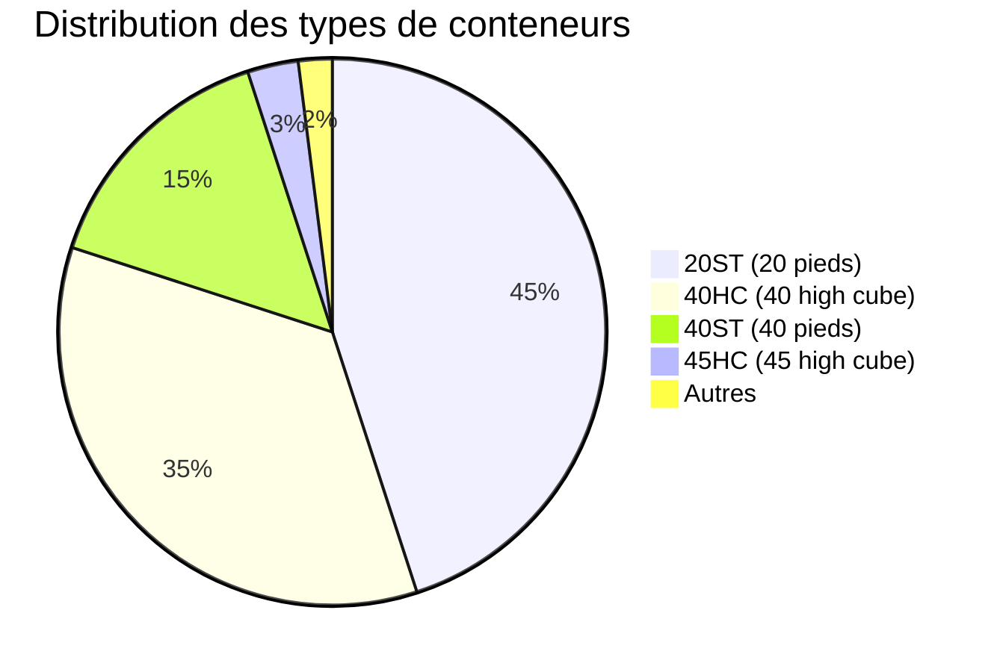
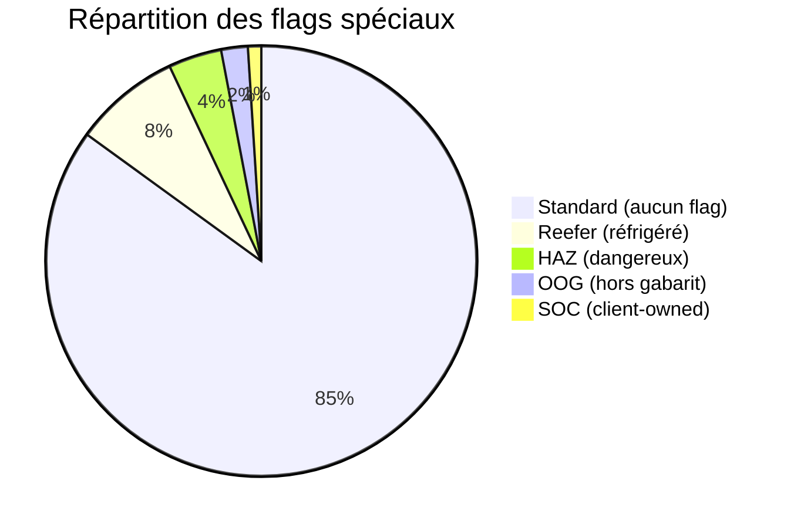

# Diagramme de la Base de Données Supabase

## Architecture globale

## Structure des tables

## Flux de données

## Hiérarchie Client / Transporteur / Booking

## Distribution géographique

## Timeline des données

## Index de performance

## Flux d'analyse typique

## Types de conteneurs

## Flags spéciaux

---

## Légende

- **PK** : Primary Key (clé primaire)
- **FK** : Foreign Key (clé étrangère)
- **TEU** : Twenty-foot Equivalent Unit (unité de mesure conteneur)
- **POL** : Port of Loading (port de chargement)
- **POD** : Port of Discharge (port de déchargement)
- **HAZ** : Hazardous (marchandise dangereuse)
- **OOG** : Out of Gauge (hors gabarit)
- **SOC** : Shipper Owned Container (conteneur du client)

---

**Note** : Les diagrammes Mermaid s'affichent automatiquement dans les éditeurs compatibles (GitHub, Cursor, VSCode avec extensions).
